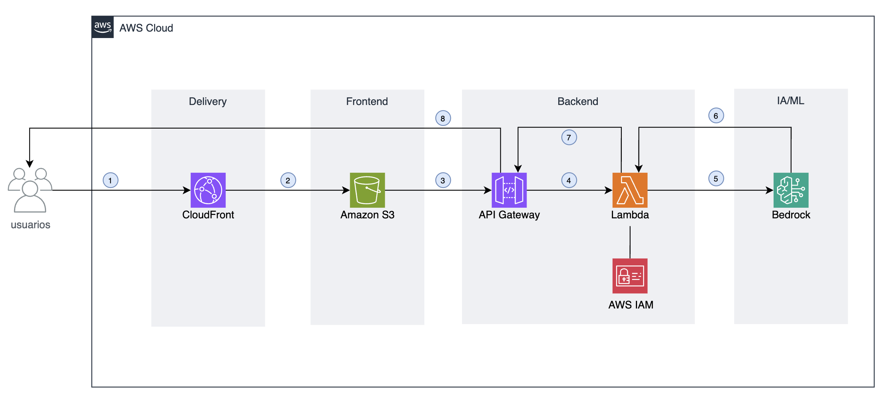

# Promptify – Generador de Prompts con AWS Bedrock

Este proyecto es una aplicación **serverless** que permite generar prompts dinámicos utilizando **Amazon Bedrock** y el modelo **Claude Haiku**.  
La arquitectura combina **S3**, **CloudFront**, **API Gateway**, **Lambda** e **IAM** para ofrecer una solución segura, escalable y en el **AWS Free Tier**.

---

## 📐 Arquitectura

### Flujo de la aplicación

1. **Usuarios → CloudFront**  
   El usuario accede desde su navegador a la aplicación web.  
   CloudFront actúa como **Content Delivery Network (CDN)**, ofreciendo el contenido con baja latencia y HTTPS.

2. **CloudFront → S3**  
   CloudFront obtiene el sitio estático (HTML, CSS y JS) almacenado en **Amazon S3** (el frontend).

3. **S3 → API Gateway**  
   Desde el frontend, las llamadas AJAX enviadas por JavaScript son redirigidas hacia **API Gateway** para comunicarse con el backend.

4. **API Gateway → Lambda**  
   API Gateway invoca la función **AWS Lambda**, que contiene la lógica para preparar la request al modelo de Bedrock.

5. **Lambda → Bedrock**  
   Lambda llama a **Amazon Bedrock**, pasando los parámetros recibidos (rol, tarea, formato, tono y contexto).  
   Bedrock procesa y genera el prompt final con el modelo **Claude Haiku**.

6. **Bedrock → Lambda**  
   Bedrock devuelve la respuesta generada a la función Lambda.

7. **Lambda → API Gateway**  
   La Lambda procesa la salida de Bedrock y responde a **API Gateway** con el prompt generado.

8. **API Gateway → Usuario**  
   Finalmente, el prompt llega al navegador del usuario, listo para ser copiado y utilizado en cualquier otra IA.

---

## 🔐 Seguridad con IAM

- **AWS IAM** administra los permisos para que **Lambda** pueda invocar a **Amazon Bedrock**.  
- Se aplica el principio de **menor privilegio**: la Lambda solo tiene permisos para `bedrock:InvokeModel` y `bedrock:Converse`, evitando accesos innecesarios a otros servicios.

---

## 🖥️ Demostracion en CloudFront

[Demo - Promptify v1.7](https://d24e3kao48qx0i.cloudfront.net)

---

## 🚀 Servicios usados

- **Amazon S3** → Hosting del frontend estático.  
- **Amazon CloudFront** → CDN y HTTPS para servir la web.  
- **Amazon API Gateway** → Puerta de entrada para las peticiones REST.  
- **AWS Lambda** → Backend serverless para llamar a Bedrock.  
- **Amazon Bedrock (Claude Haiku)** → Generación de prompts dinámicos.  
- **AWS IAM** → Seguridad y control de permisos.  

---

## 📋 Licencia

✍️ Proyecto hecho para práctica en **AWS Free Tier** y como portfolio de Cloud Engineer.
